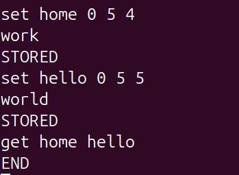

# Домашнее задание к занятию "`Кеширование Redis/memcached`" - `Сафронов Алексей`

---

### Задание 1

Повышает производительность складывая данные в оперативную память сервера, тем самым ускоряя время запроса и снижает нагрузки на сервер за счёт сокращения I/0 диска. 

---

### Задание 2

---

### Задание 3

---

### Задание 4

---

### Задание 5*

